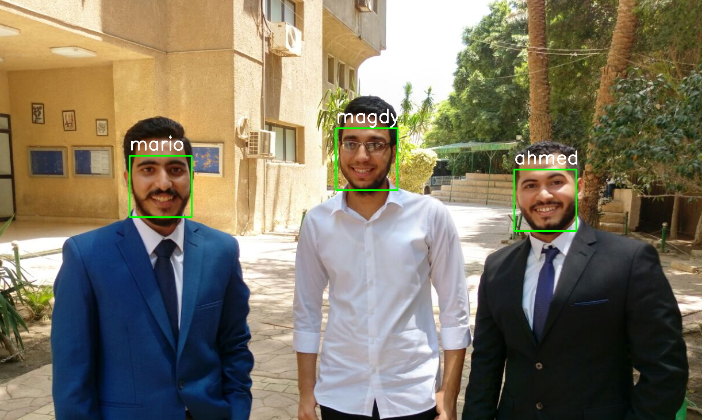
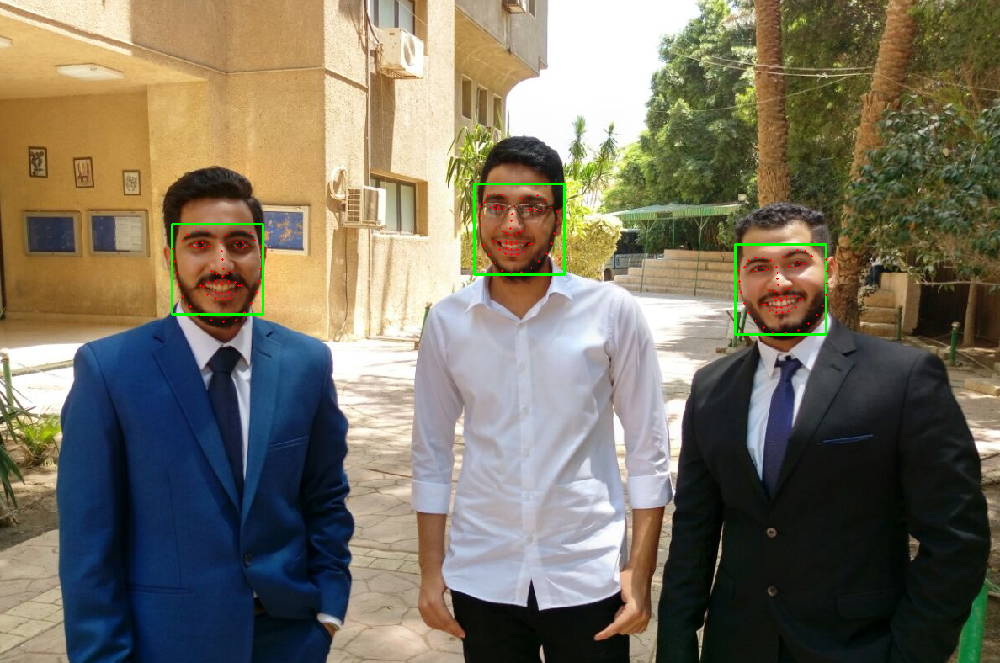

## dlib-apps
### Some apps using dlib

### First you need to download "shape_predictor_68_face_landmarks.dat" and "dlib_face_recognition_resnet_model_v1.dat" from dlib website.

#### For face recognition in images, simply call python3 face_recognition.py with optional argument -f for the known faces folder and -im for the image to predict faces from.

##### example of output 

  

#### For face keypoints in images, simply call python3 face_keypoints.py with optional argument -im for the image to predict faces from.

##### example of output 

  

#### predict_smile_blink_from_video.ipynb, can predict smile and blink from face keypoints in realtime.

